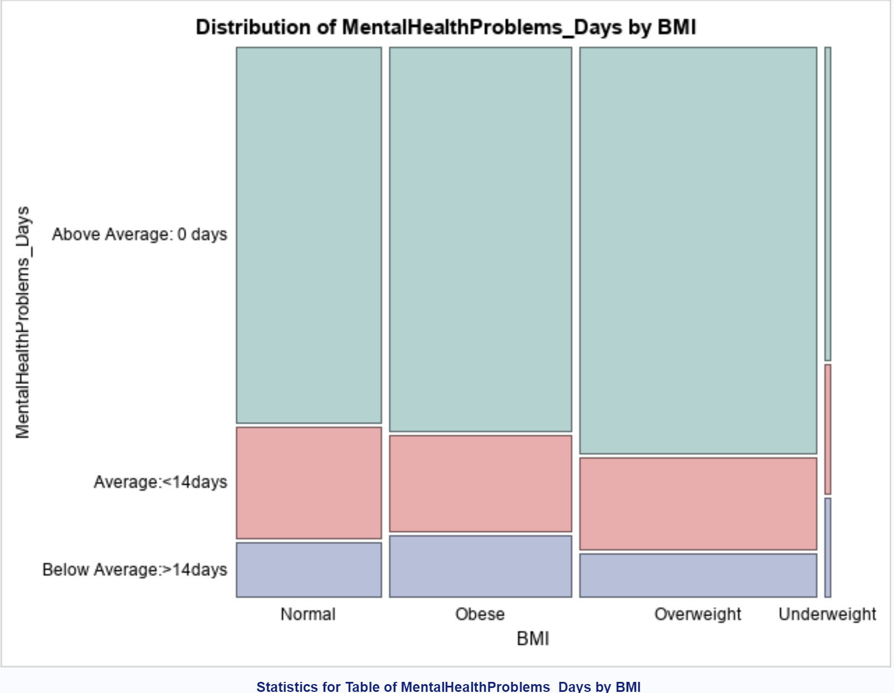
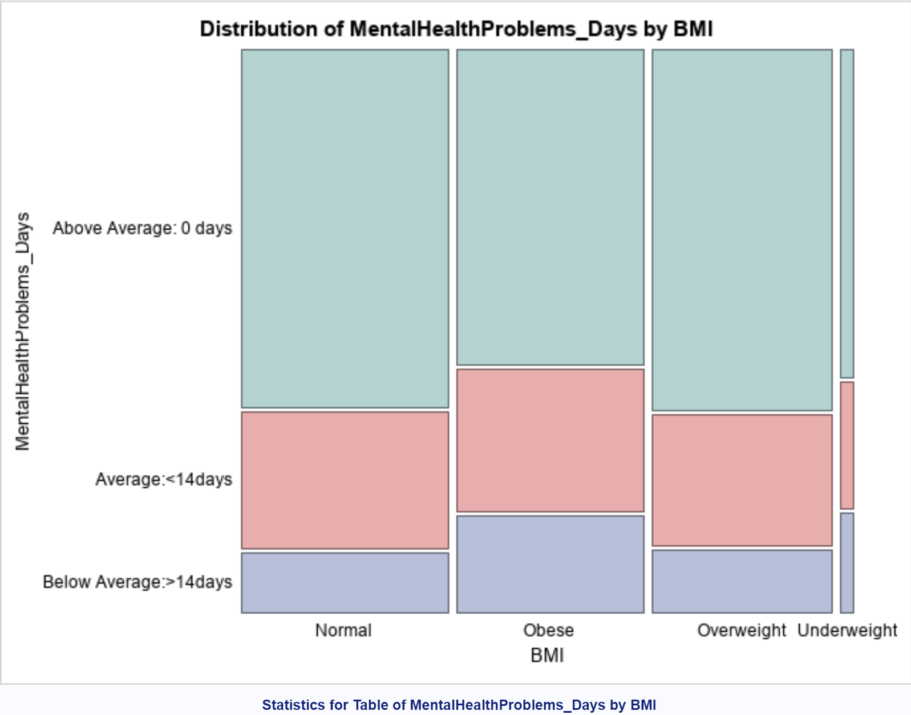

# Analyse-MentalHealthDataUS
## Analysis of BRFSS 2018 data for the possible factors that lead to more days of mental health issues in a citizen.
....

The Behavioral Risk Factor Surveillance System(BRFSS) is a yearly survey conducted via telephone for the citizens of US. The survey is done in order to analyse the health-related risks,chronic health conditions and use this to provide preventive measures to improve public health. It interviews 400,000 plus adults all across United States.

This project however focuses on Mental Health issues and possible factors for it. 
Part 1 focuses on the basis of how the Body Mass Index(BMI) affects Mental Health across both Genders.
Part 2 elaborates on factors namely Physical Health, Education, Income, Marital Status, Sex and Age which could possibly be a cause for mental health problem like stress, depression, and problems with emotions.

## Software Used: SAS

-Various DATA and PROC statements used along with Macros.
-Univariate Analysis
-Multivariate Analysis
-Logistic Regression Models

## Part1 :
Results: -Obese Women have approx 14% more number of days with mental health problems when compared to men.
         -Overweight women have approx 10.15% more number of days with mental health problems when compared to men.
         
###                        Male Stats                 

###                        Female Stats

###                       Logistic Regression1: ROC Curve: Factors- BMI, Gender
.png)

###                       Logistic Regression2: ROC Curve: Factors- BMI, Gender, Income, Education, MaritalStatus, Age, Physical Health
.png)

### Result: Respondants who are have higher BMI, have lower income, are either divorced or single and who do not exercise are likely to have more days with mental health issues.

